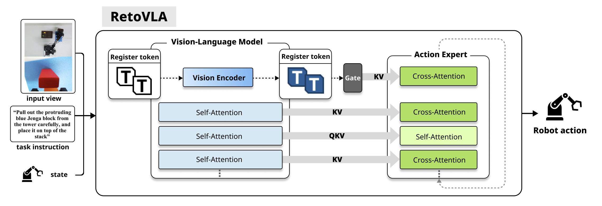
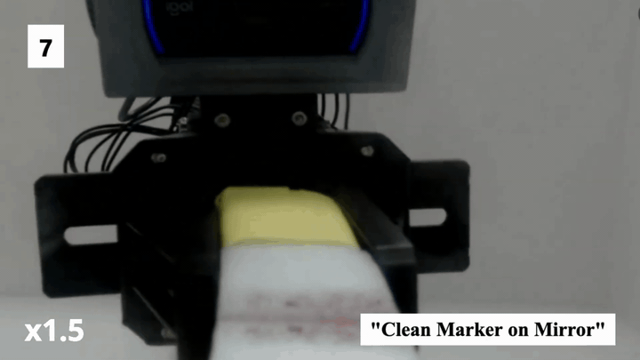
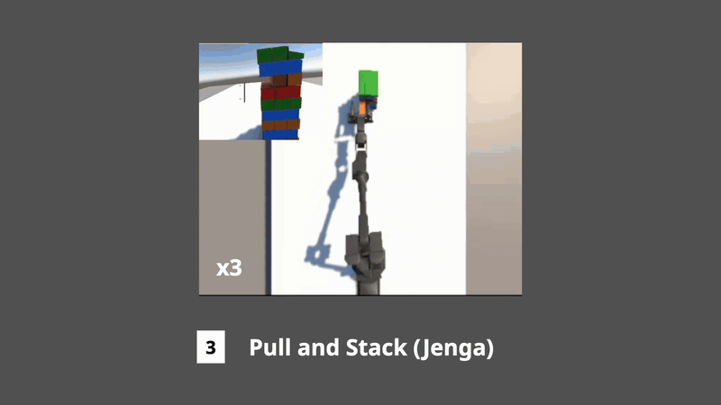

<div align="center">

# RetoVLA

RetoVLA reuses Register Tokens to inject global spatial context into the Action Expert of lightweight Vision-Language-Action (VLA) models.

**🎉Accepted to ICRA 2026 🇦🇹**

Jiyeon Koo<sup>†</sup>, Taewan Cho<sup>†</sup>, Hyunjoon Kang, Eunseom Pyo, Tae Gyun Oh, Taeryang Kim, and Andrew Jaeyong Choi*  
*School of Computing, Gachon University*  
<sup>†</sup>Co-first authors &nbsp;&nbsp;&nbsp; *Corresponding author


<p align="center">
  <a href="https://arxiv.org/abs/2509.21243"></a>
  <a href="https://youtu.be/2CseBR-snZg"></a>
  <a href="LICENSE"></a>
  
</p>

</div>

## Highlights

- Reinterprets Register Tokens as reusable spatial context rather than discarded artifacts.
- Introduces a lightweight Spatial Context Injection path that integrates Register Tokens into the Action Expert.
- Improves real-world mean success rate by +17.1 percentage points (50.28% → 67.42%) on a custom 7-DOF robot arm.

## Architecture



RetoVLA follows a standard VLM-based policy pipeline (vision–language backbone → Action Expert), but changes the information flow by adding a second stream of **global spatial context**.

- The Vision Encoder produces visual patch features.
- A lightweight **Spatial Context Aggregator** uses a small number of learnable **Register Tokens** as queries over the patch features to produce scene-conditioned register tokens.
- A learnable gate controls how much register context is used.
- The gated register tokens are projected and injected as additional **Key/Value** pairs into the Action Expert’s cross-attention (at the final layer), allowing action queries to attend to both semantic VLM features and global spatial layout.

This design is intentionally minimal: it keeps the backbone lightweight while improving performance on spatially demanding, long-horizon manipulation tasks.

## Demos

<table>
  <tr>
    <td align="center">
      
      <br />
      <sub><b>Real-world montage</b></sub>
    </td>
    <td align="center">
      
      <br />
      <sub><b>Clean marker on mirror</b></sub>
    </td>
  </tr>
  <tr>
    <td align="center">
      
      <br />
      <sub><b>Dataset collection</b></sub>
    </td>
    <td align="center">
      
      <br />
      <sub><b>Custom simulation montage</b></sub>
    </td>
  </tr>
</table>


## Installation & Environment
Update coming soon


## Citation

If you use this work, please cite:

```bibtex
@misc{koo2025retovlareusingregistertokens,
  title={RetoVLA: Reusing Register Tokens for Spatial Reasoning in Vision-Language-Action Models},
  author={Jiyeon Koo and Taewan Cho and Hyunjoon Kang and Eunseom Pyo and Tae Gyun Oh and Taeryang Kim and Andrew Jaeyong Choi},
  year={2025},
  eprint={2509.21243},
  archivePrefix={arXiv},
  primaryClass={cs.RO},
  url={https://arxiv.org/abs/2509.21243}
}
```
